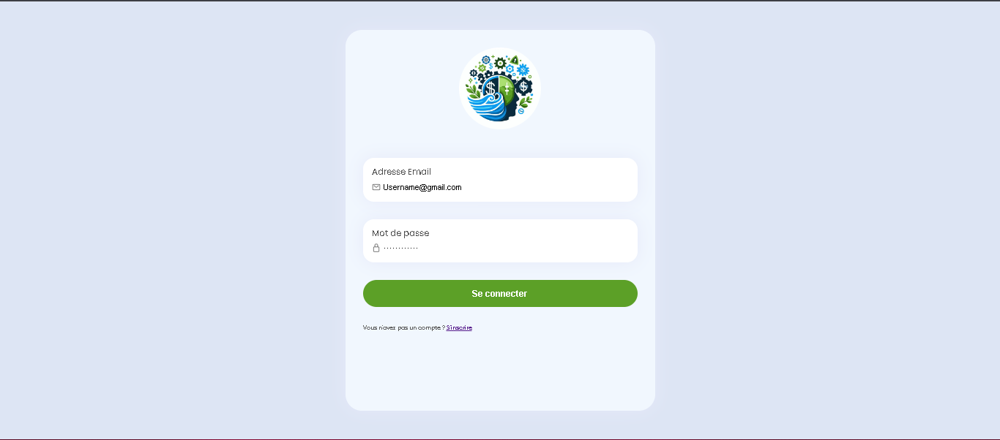
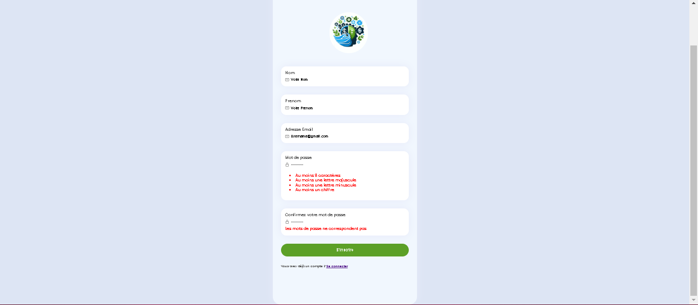
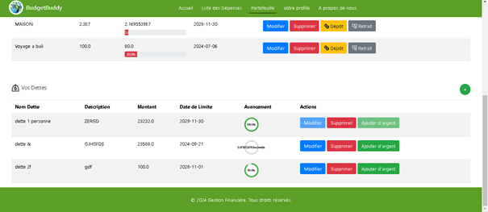

# Personal Budget Management System

This project is a comprehensive personal budget management system, allowing users to manage their finances effectively through secure authentication, budget tracking, financial goals, debt management, and expense monitoring.

## Features

This application offers the following functionalities:

- **User Authentication**
  - Create a user account with basic information and securely authenticate.
  
- **Budget Management**
  - Create, edit, and delete custom budgets for different spending categories.
  
- **Expense Tracking**
  - Add and manage expenses, associating them with specific budgets and editing or deleting them as needed.
  
- **Monthly Expense Planning**
  - View monthly spending plans to better understand future financial status.
  
- **Financial Goals**
  - Set financial goals with deadlines and monitor progress over time.
  - Make deposits or withdrawals to reach financial goals.

- **Debt Management**
  - Track repayment progress, add funds, and update debt details.

- **User Profile**
  - Update profile information, including password changes, and log out securely.

## 🛠️ Technologies & Tools

## Screenshots

Below are some screenshots illustrating the application's interface and functionalities:

### Log in user

### Register User

### Budget Management

### Expense Tracking

### Wallet (where user can set financiel goals and add debts )

### User Profile Management

## Contributors

- **Your Name** - Project Creator and Developer  
  [LinkedIn Profile](www.linkedin.com/in/maroua-ourahma-293426235)

Feel free to reach out for collaboration or any inquiries!

